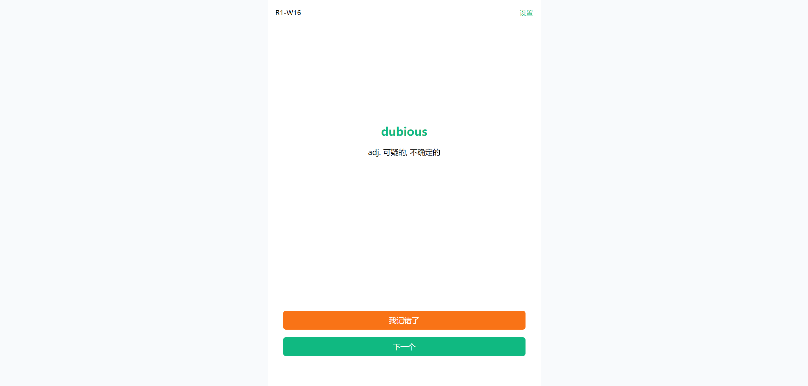
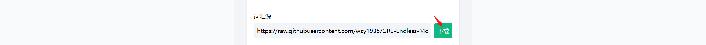
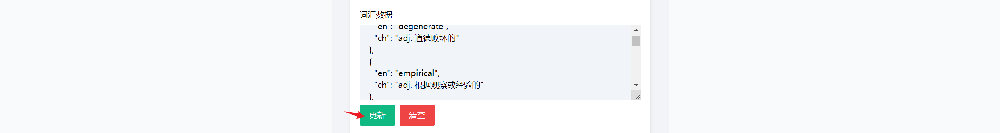
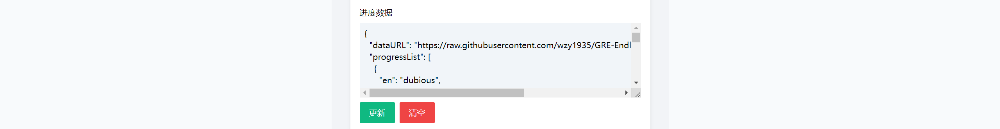

# GRE Endless Mode

一个背GRE单词的网站。

Nightly: https://gre-endless-mode.vercel.app （需要科学上网）



整体是仿的扇贝单词的背词形式和界面。与之不同的是：

- 没有单天背诵上限限制，是无尽循环；
- 支持离线模式；
- 允许自定义词库；


## 使用说明

**使用前首先需要导入词库。**进入网页后，点击”设置“，找到”词汇源“项，点击”下载“来获取词库。默认词库是佛脚词的乱序版。下载完毕后就可以背词了。


### 自定义词库



在设置里可以设置词汇源。设置好词汇源地址后下载即可。可本仓库内置的Wordlist：

```
https://raw.githubusercontent.com/wzy1935/GRE-Endless-Mode/master/wordlist/<FILE_NAME>
```

`FILE_NAME`对应`/wordlist`文件夹下的资源。目前内置的词库有：

- `fj_ordered.json`: 佛脚词正序版
- `fj_shuffled.json`: 佛脚词乱序版


也可以完全自定义Wordlist。



在词汇数据栏里填写json列表格式的单词数据。每个item的格式如下：

```json
{"en": "英文词汇", "ch": "中文释义"}
```

更改完后点击更新即可。


### 进度数据



此项目为纯前端项目，因为没有后端，所以所有数据都存在浏览器的localStorage里，这意味着进度无法跨浏览器或设备保存。不过你也可以通过手动保存来同步。只要在需要数据迁移的时候复制进度数据里的内容，在切换时粘贴并点击”更新“即可。